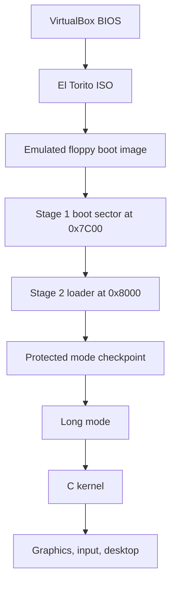

# LiquidOS Architecture

LiquidOS is built in small checkpoints. Every checkpoint should boot, show a visible result, and give us a stable place to debug from.

## Big Picture



## Why BIOS First

VirtualBox can boot both BIOS and UEFI guests, but BIOS is the smaller first target.

BIOS gives us:

- a predictable first address: `0x7C00`
- simple disk reads through interrupt `0x13`
- simple text output through interrupt `0x10`
- a clear path to learning protected mode and long mode

UEFI is useful later, but it adds a large firmware API before we have learned the CPU basics.

## Boot Image Layout

The generated floppy image is exactly 1.44 MB:

```text
Offset      Size       Contents
0x000000    512 B      Stage 1 boot sector
0x000200    8192 B     Stage 2 loader, padded to 16 sectors
remaining   rest       zero-filled space
```

The generated ISO contains that floppy image as an El Torito boot image. VirtualBox sees the ISO as a CD/DVD, then BIOS treats the embedded image like a boot floppy.

## Stage 1

Stage 1 is intentionally tiny because BIOS loads only one sector at first.

Responsibilities:

- set segment registers and stack
- save BIOS boot drive number
- print startup messages
- read Stage 2 from fixed disk sectors
- jump to Stage 2

Stage 1 does not understand filesystems yet. That is a deliberate beginner-friendly choice: fixed sectors are easier to debug than FAT parsing.

## Stage 2

Stage 2 is larger and can do real preparation work.

Phase 1 responsibilities:

- clear the screen
- print status messages
- enable A20
- install a Global Descriptor Table
- enter 32-bit protected mode
- write directly to VGA memory

The final VGA message proves an important point: once protected mode is active, the loader is no longer relying on BIOS text output.

## Future Kernel Shape

The kernel now uses this structure:

```text
kernel/
  arch/x86_64/    CPU setup, interrupts, paging, port I/O
  core/           kernel entry, panic, logging
  mm/             physical memory and heap allocation
  drivers/        framebuffer, keyboard, mouse, power
  gfx/            drawing, text, double buffering
  ui/             desktop, taskbar, windows, terminal
  fs/             initramfs and VFS foundation
  lib/            tiny freestanding C library helpers
```

The first kernel will be monolithic. That means graphics, input, memory, and desktop code all live in one kernel address space. This is simpler, more stable for a first OS, and easier to expand gradually.

## Desktop OS Services

LiquidOS keeps early desktop services inside the kernel shell until the process
model and userspace app framework are strong enough to host them separately.

Current service boundaries:

- Window manager state belongs to `kernel/ui/desktop.c`: each window tracks open,
  minimized, maximized, restore geometry, focus, and z-order.
- File operations go through LiquidFS APIs instead of UI-only state. The Files app
  calls `fs_copy`, `fs_rename`, `fs_write`, and `fs_delete`, so operations persist
  when disk-backed LiquidFS is available.
- Notifications are shell-level records with a toast and history surface. This
  gives Store, Files, Settings, and Control Center a shared notification path.
- Task management uses the process table. Settings can inspect process state and
  force-stop user processes through `process_kill`.

These are intentionally small, working primitives. They are not yet separate
daemons, but they create the contracts needed for a later userspace desktop
environment.
